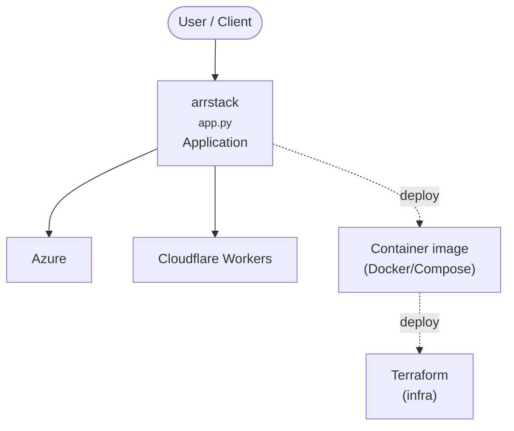

# Project Documentation

This document provides an overview of the folders in this project and their purpose.

## Folders

### 📂 `Consulting-upwork`

This folder contains scripts and files related to Upwork consulting.

*   `get_info_job_info.py`: A Python script to fetch job information from Upwork using the Upwork API.
    *   **Usage**: You will need to have the `python-upwork` library installed (`pip install python-upwork`) and have your own Upwork API key and secret to use this script.
*   `html-page.html`: An empty HTML file.

### 📂 `terraform`

This folder contains Terraform configuration to automate the deployment of virtual machines on a Proxmox server.

*   `main.tf`: The main Terraform configuration file. It defines the resources to be created, including a Debian VM and a Home Assistant VM. It uses remote-exec provisioners to run scripts on the Proxmox host and the newly created VMs.
*   `variables.tf`: Defines the variables used in `main.tf`. You can customize your Proxmox connection details and other settings here.
*   `config router route-map.sh`: A shell script to configure BGP routing on a router.
*   **Usage**: To use these Terraform files, you will need to have Terraform installed and configured with access to your Proxmox server.

### 📂 `.vscode`

This folder contains workspace-specific settings for the Visual Studio Code editor.

*   `settings.json`: Contains JSON with settings for this project.

<!-- ARCH-DIAGRAM:START -->

## Architecture

> Auto-generated architecture diagram. See [`docs/context-map.md`](docs/context-map.md) for the full context map (core application, containers/cloud, and database connections).

<!-- ARCH-DIAGRAM:END -->
