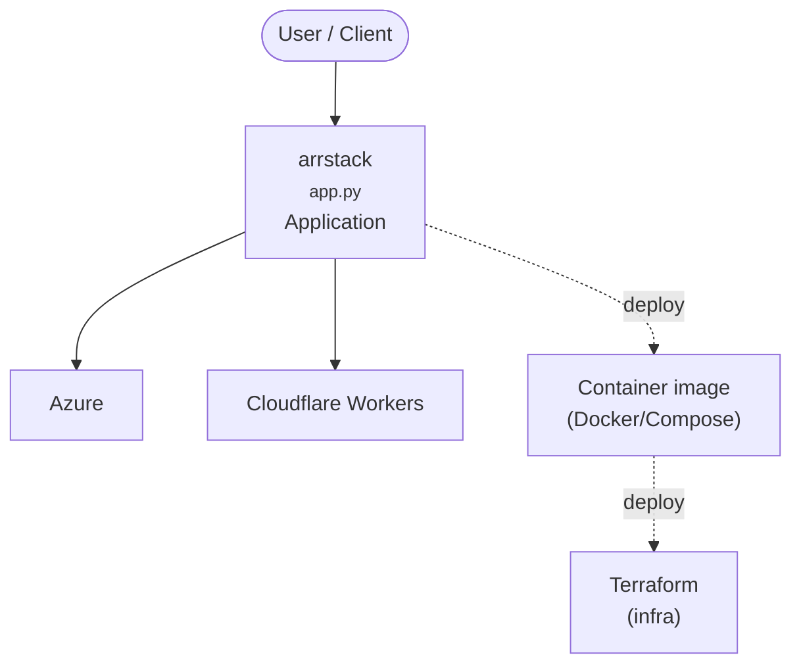

# Context Map — `arrstack`

> Auto-generated architecture & deployment context map. Summarizes the core application, container/cloud footprint, and database connections. Regenerate after significant structural changes.

**Repo:** `avnit/arrstack` · **Original** · Public · Primary language: HCL · Default branch: `main` · Files: 29

## 1. Core application

Project Documentation

- **Entry points:** `Consulting-upwork/app.py`
- **Listens on port(s):** 5000, 5055, 7575, 7878, 8096, 8181

## 2. Containers & cloud applications

**Containers:**
- `Consulting-upwork/Dockerfile`
- `docker-compose.yml`

**Infrastructure as Code:**
- `terraform/main.tf`
- `terraform/outputs.tf`
- `terraform/variables.tf`

**Detected cloud platforms / services:** Azure, Cloudflare Workers, Terraform

## 3. Database connections

_No database drivers or connection strings detected._

## 4. Architecture diagram

## 5. Security posture

- **Static scan findings:** 1 critical, 1 high, 1 medium

| Severity | Rule | File:Line |
|---|---|---|
| critical | private-key-block | `terraform/root@192.168.74.1:1` |
| high | py-flask-debug | `Consulting-upwork/app.py:12` |
| medium | js-innerhtml | `Consulting-upwork/html-page.html:38` |

---
_Generated by repo context-mapping pass on 2026-08-13._